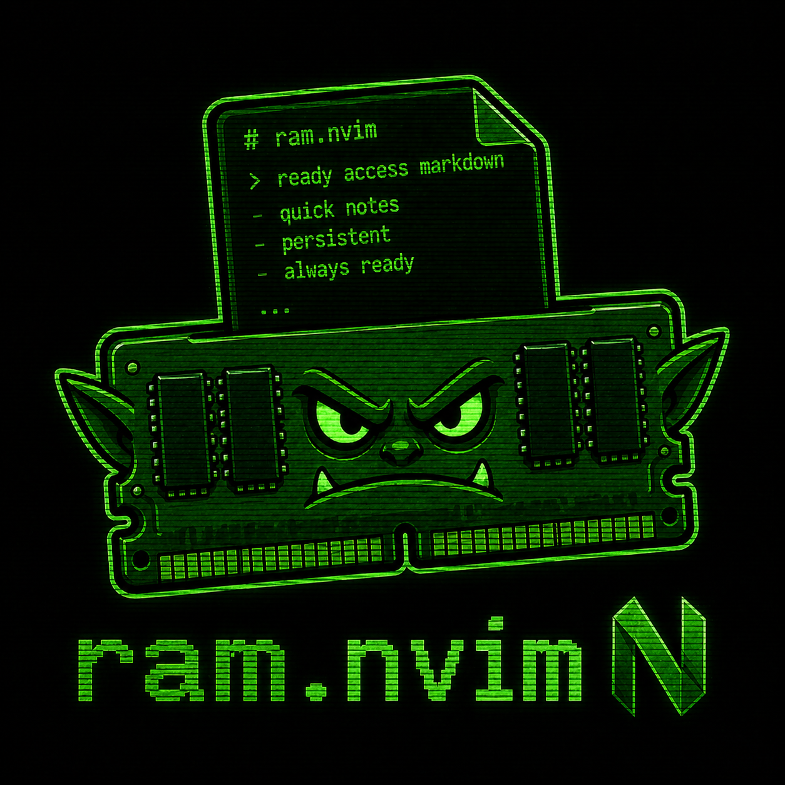

<div align="center">



(Ready Access Markdown)

[](https://neovim.io)
[](https://www.lua.org)
[](./LICENSE)
[](https://github.com/sektant1/ram.nvim/stargazers)
[](https://github.com/sektant1/ram.nvim/issues)

</div>

---

Two notes:
- **global**  one note, everywhere
- **project**  one note per project root

Files on disk. No state loss.

<div align="center">


</div>

## Install

### lazy.nvim

```lua
{
  "sektant1/ram.nvim",
  opts = {},
  keys = {
    { "<leader>rg", function() require("ram").global() end,  desc = "Ram global" },
    { "<leader>rp", function() require("ram").project() end, desc = "Ram project" },
    { "<leader>rr", function() require("ram").toggle() end,  desc = "Ram toggle" },
    { "<leader>rx", function() require("ram").close() end,   desc = "Ram close" },
  },
  cmd = { "RamGlobal", "RamProject", "RamToggle", "RamClose" },
}
```

### vim.pack (Neovim 0.12+)

```lua
vim.pack.add({ "https://github.com/sektant1/ram.nvim" })
require("ram").setup({})
```

## Keys

No defaults. Bind whatever you want via lazy `keys = {}` (see install snippet) or `setup({ keymaps = { ... } })`.

Inside a ram buffer: `q` closes (buffer-local).

Reopen same note = close. Different note = swap.

## Where files live

- global: `stdpath("data")/ram/global.md`
- project: `<project_root>/.ram.md`

Project root = walk up cwd, find `.git` / `package.json` / `Cargo.toml` / `pyproject.toml` / `go.mod` / `Makefile`. None? Use cwd.

## Config (defaults)

```lua
require("ram").setup({
  display = "float",  -- float | split | vsplit | tab
  float = { width = 0.6, height = 0.7, border = "rounded", title = " RAM " },
  global_note_path = nil,
  project_note_filename = ".ram.md",
  project_root_markers = {
    ".git", ".hg", ".svn",
    "package.json", "Cargo.toml", "pyproject.toml", "go.mod",
    "Makefile", ".ram.md",
  },
  keymaps = {
    global  = false,  -- e.g. "<leader>rg"
    project = false,  -- e.g. "<leader>rp"
    toggle  = false,  -- e.g. "<leader>rr"
    close   = false,  -- e.g. "<leader>rx"
  },
  filetype = "markdown",
  autosave = true,
})
```

Any keymap = `false` to disable. `project_root_markers = {}` = strict cwd.

## Commands

`:RamGlobal` `:RamProject` `:RamToggle` `:RamClose`

## Health

```
:checkhealth ram
```

## License

MIT.
